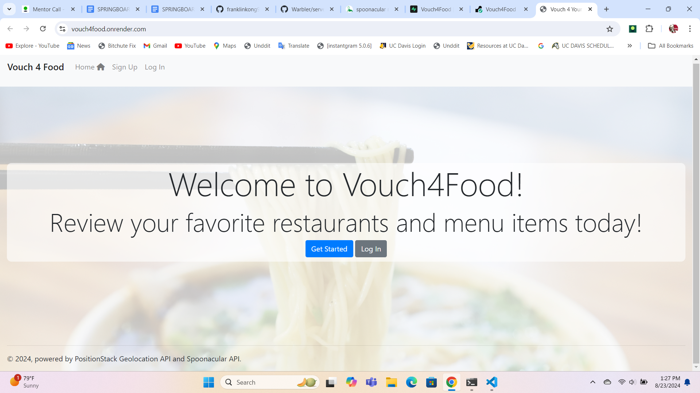

# [Vouch4Food] (https://vouch4food.onrender.com) - A Guide

## Overview

Vouch4Food is a website where you can review restaurant locations that you've been to, as well as menu items you've eaten at these
restaurants. This way, other users will be able to see which menu items at restaurants are the most popular and the most enjoyed.
Since sometimes different customers may have different experiences at the same restaurant due to the menu items they order, having
restaurant and menu item reviews would help other users have a better understanding of what makes a restaurant popular or unpopular.

## Walkthrough

Vouch4Food consists of 2 main features: The ability to bookmark their favorite restaurants/menu items and the ability for users to 
create, edit, and delete their own reviews for restaurants/menu items.

Upon first visiting the website, users will be directed to the homepage.

Spoonacular (for restaurant and menu item lookup): https://spoonacular.com/food-api

Positionstack (for geocoding, address to longitude/latitude conversion): https://positionstack.com/ 

[Visit Vouch4Food here] (https://vouch4food.onrender.com)